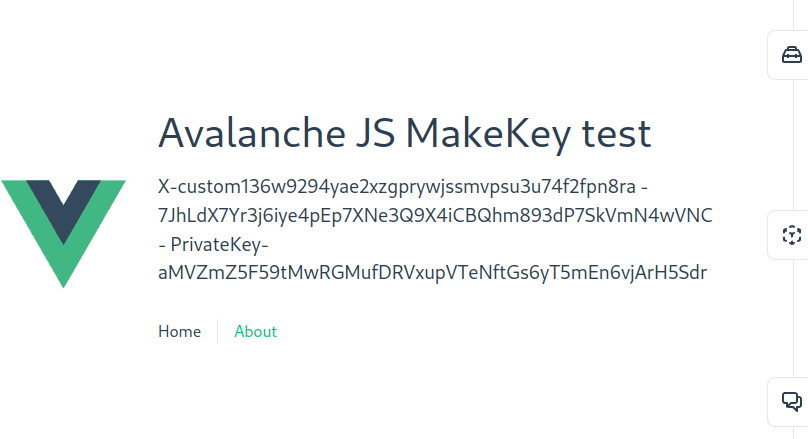

# vue-avalanchejs-demo
How to configure a new vuejs app to use avalanchejs

## TLDR
This [Commit diff](https://github.com/boulix3/vue-avalanchejs-demo/commit/29607253d301f9d28ba8415687084e315d9fe165) contains everything needed.

### Create vue app

```sh
npm create vue@3
```

### Install avalanchejs and configure browserify

```sh
npm install avalanche browserify
```

Modify vite.config.ts
```ts
// https://vitejs.dev/config/
export default defineConfig({
  plugins: [vue()],
  resolve: {
    alias: {
      'util': "util/", 
      'buffer': "buffer/",
      'stream': 'stream-browserify',
      '@': fileURLToPath(new URL('./src', import.meta.url))
    }
  },
  define: {
    global: {},
    process: { env: {} },
  }
})
```


### Quick test

Modify components/HelloWorld.vue and use avalanchejs to make keys 

```vue
<script setup lang="ts">
import { Avalanche } from "avalanche/dist"
import type { AVMAPI, KeyChain, KeyPair } from 'avalanche/dist/apis/avm'
const ip: string = "localhost"
const port: number = 9650
const protocol: string = "http"
const networkID: number = 1337
const avalanche: Avalanche = new Avalanche(ip, port, protocol, networkID)
const xchain: AVMAPI = avalanche.XChain()
const keychain: KeyChain = xchain.keyChain()
const keypair: KeyPair = keychain.makeKey()
function GetKeyPair(): string {
  var address = keypair.getAddressString();
  var publicKey = keypair.getPublicKeyString();
  var privateKey = keypair.getPrivateKeyString();
  return address + " - " + publicKey + " - " + privateKey;
}
</script>

<template>
  <div class="greetings">
    <h1>Avalanche JS MakeKey test</h1>
    <h3>{{ GetKeyPair() }}</h3>
  </div>
</template>
```

Run the app in dev mode and you should have something like this.
```sh
npm run dev
```



